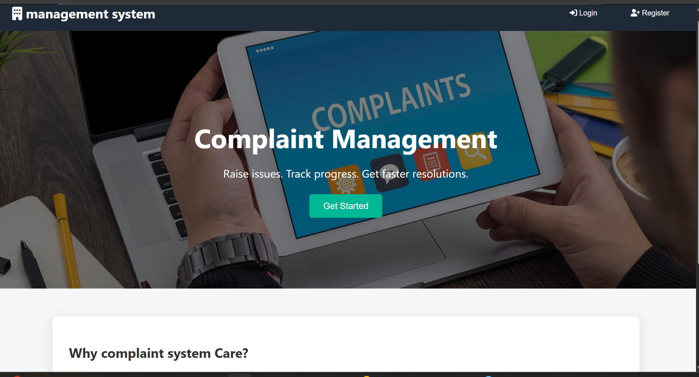
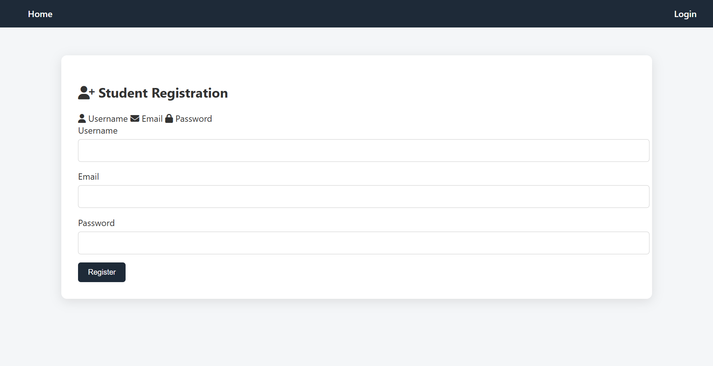
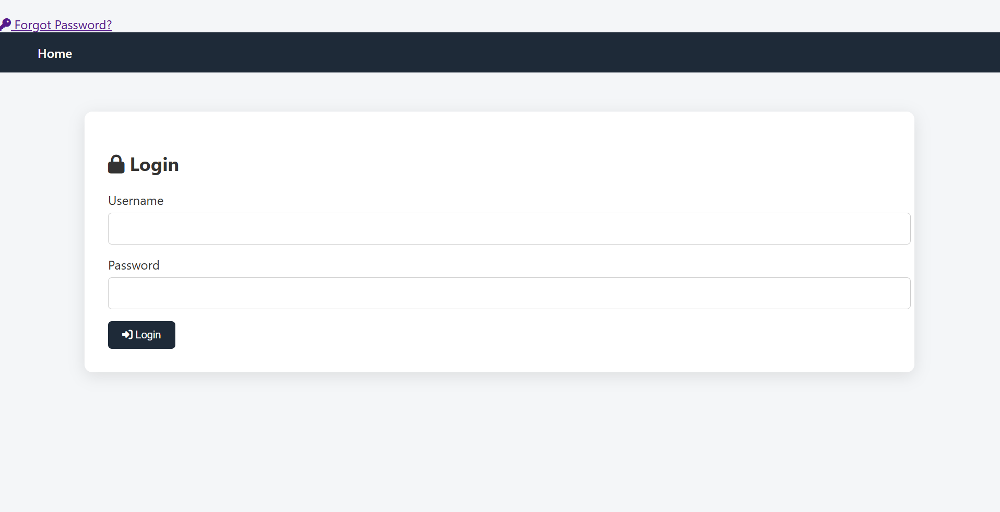
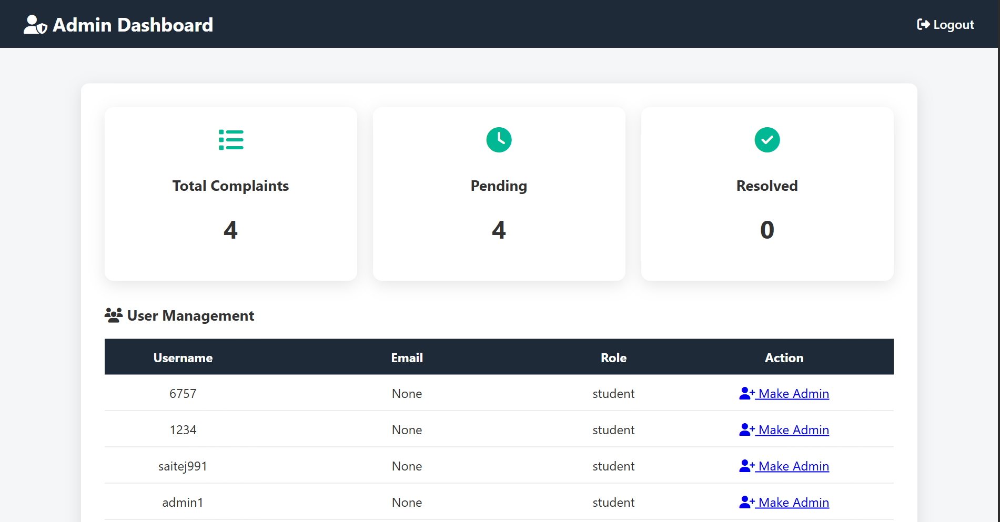
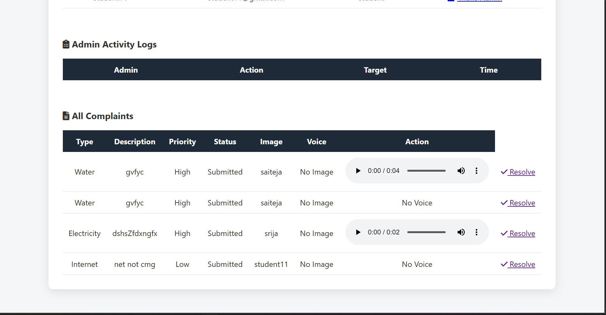
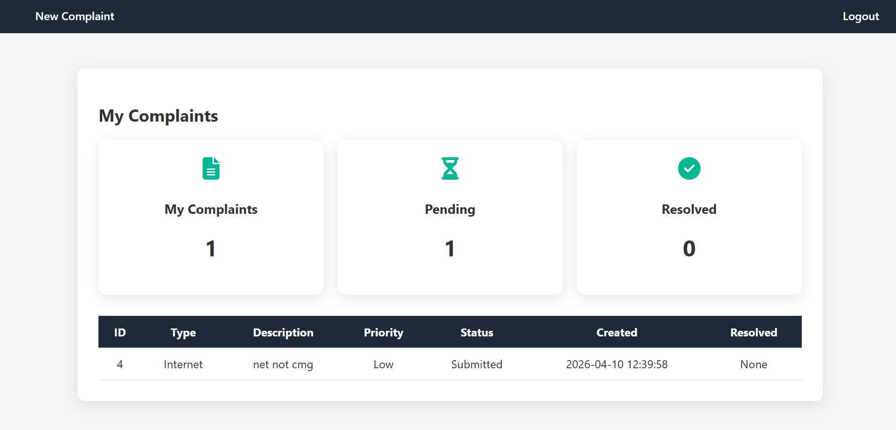
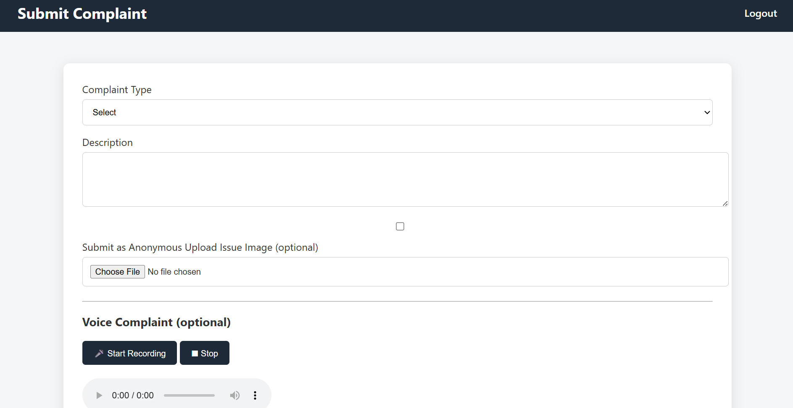

# Complaint Management System

A web-based complaint management system developed for students to register and track complaints efficiently.

# Features
- Student complaint registration
- Complaint tracking system
- User-friendly interface
- Organized complaint workflow
- Improved communication between students and administration

# Technologies Used
- HTML
- CSS
- JavaScript
- Python
- SQL

# Purpose
This project helps students digitally submit complaints and track their complaint status effectively.

# Future Improvements
- Admin dashboard
- Email notifications
- Login authentication
- Real-time complaint tracking

- **## 📸 Project Screenshots

### Home Page

### Registration page

### Login Page

### Dashboard

### Complaint Form
**

# Author
Srigoundla Saiteja
